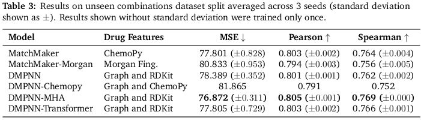
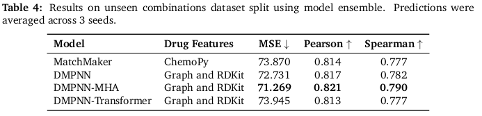
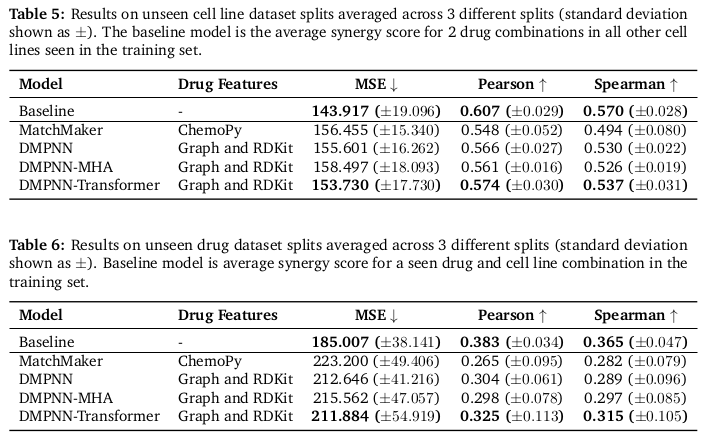

# DMPNN-MatchMaker
## Drug Synergy Prediction with Learned Embeddings

This repository contains code for predicting drug synergies (based on [MatchMaker model](https://github.com/esidorovics/matchmaker-pytorch)) using learnt molecular embeddings (based on [ChemProp](https://github.com/chemprop/chemprop)). 

The thesis can be find in [here](masters_thesis.pdf).
## Requirements
You can use `environment.yml` to install all the dependancies.

    conda env create -f environment.yml
    conda activate dmpnn

## Data
For the experiments, the [DrugComb dataset](https://drugcomb.org/) (Zagidullin et al., 2019). All the processing steps and rationale behind them can be seen in the section 5.1 of the [thesis](masters_thesis.pdf). 
In summary:
- Removed the monotherapy samples. 
- If one triplet (drug, drug, cell line) had multiple samples with different concentrations, a sample with the highest Loewe score was used.
- Outliers were removed (where the Loewe score is lower than -200 and higher than 200). 
- 
Our final dataset contains 338 380 samples. Dataset is available in `data/DrugCombData_1.5.csv`

For the training/validation/testing we need to know SMILES representation of the molecule to extract all the atom/bond features for the graph. CSV file with SMILES representations is `data/DrugCombData_train_1.5.csv`. Train/Validation/Test indeces splits are available in the `data/` folder. 

Cell line data (features) are available for download from [here](https://drive.google.com/drive/folders/1C4C4KY0ypLNzSaRLU6_0a84QONp7gPWz).

## Training
    python -u train.py --data_path=data/DrugCombData_train_1.5.csv --cell_lines=data/cell_line_gex.csv --train_index=data/train_inds.txt --val_index=data/val_inds.txt --test_index=data/test_inds.txt --features_generator rdkit_2d_normalized --no_features_scaling

## Pretrained Models
Pretrained models are available [here](https://drive.google.com/drive/folders/1C4C4KY0ypLNzSaRLU6_0a84QONp7gPWz).

## Results
All results and analysis is available in `masters_thesis.pdf`.

Some extracts:

